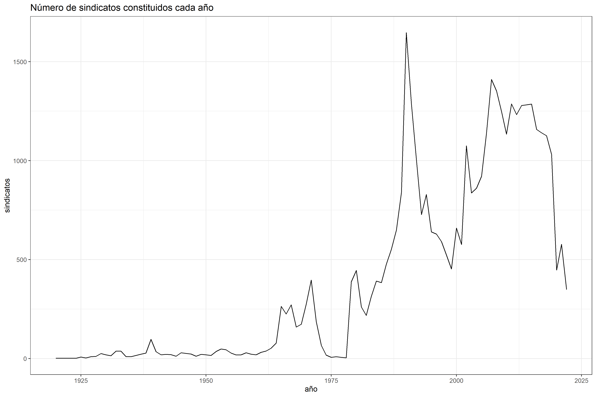

class: inverse, center, title-slide, middle

# *sindicatoscl*

## Paquete en R para acceder a registro administrativo de sindicatos

### [Nicolás Ratto](https://github.com/nicolasrattor/)

### `r Sys.Date()`

<a href="https://github.com/nicolasrattor/sindicatoscl" class="github-corner" aria-label="View source on Github"><svg width="80" height="80" viewBox="0 0 250 250" style="fill:#fff; color:#151513; position: absolute; top: 0; border: 0; right: 0;" aria-hidden="true"><path d="M0,0 L115,115 L130,115 L142,142 L250,250 L250,0 Z"></path><path d="M128.3,109.0 C113.8,99.7 119.0,89.6 119.0,89.6 C122.0,82.7 120.5,78.6 120.5,78.6 C119.2,72.0 123.4,76.3 123.4,76.3 C127.3,80.9 125.5,87.3 125.5,87.3 C122.9,97.6 130.6,101.9 134.4,103.2" fill="currentColor" style="transform-origin: 130px 106px;" class="octo-arm"></path><path d="M115.0,115.0 C114.9,115.1 118.7,116.5 119.8,115.4 L133.7,101.6 C136.9,99.2 139.9,98.4 142.2,98.6 C133.8,88.0 127.5,74.4 143.8,58.0 C148.5,53.4 154.0,51.2 159.7,51.0 C160.3,49.4 163.2,43.6 171.4,40.1 C171.4,40.1 176.1,42.5 178.8,56.2 C183.1,58.6 187.2,61.8 190.9,65.4 C194.5,69.0 197.7,73.2 200.1,77.6 C213.8,80.2 216.3,84.9 216.3,84.9 C212.7,93.1 206.9,96.0 205.4,96.6 C205.1,102.4 203.0,107.8 198.3,112.5 C181.9,128.9 168.3,122.5 157.7,114.1 C157.9,116.9 156.7,120.9 152.7,124.9 L141.0,136.5 C139.8,137.7 141.6,141.9 141.8,141.8 Z" fill="currentColor" class="octo-body"></path></svg></a><style>.github-corner:hover .octo-arm{animation:octocat-wave 560ms ease-in-out}@keyframes octocat-wave{0%,100%{transform:rotate(0)}20%,60%{transform:rotate(-25deg)}40%,80%{transform:rotate(10deg)}}@media (max-width:500px){.github-corner:hover .octo-arm{animation:none}.github-corner .octo-arm{animation:octocat-wave 560ms ease-in-out}}</style>

```{r setup, include=FALSE}
options(htmltools.dir.version = FALSE)
```

```{r xaringan-themer, include=FALSE, warning=FALSE}
library(xaringanthemer)
style_duo_accent(
  primary_color = "#1381B0",
  secondary_color = "#1381B0",
  inverse_header_color = "#FFFFFF"
)
```

```{r echo=FALSE,include=FALSE}
#pagedown::chrome_print(input="presentacion.html",output="presentacion.pdf")
```

---

# Introducción

```{r echo=FALSE, warning=FALSE, message=FALSE}
library(sindicatoscl)
library(dplyr)
library(ggplot2)
```

--

Paquete desarrollado en el marco del [Repositorio de Estadísticas Sindicales](https://repositoriosindical.netlify.app/)

--

El paquete permite disponer de una "base de datos" con el listado de todos los sindicatos activos y en receso en Chile y, sus principales características.

--

El dataframe sindicatos contiene `r nrow(sindicatos)` observaciones, siendo las variables más relevantes:

+ tipo de sindicato

+ socios y socias

+ fecha de constitución

+ rut de empresa del sindicato

+ Actividad económica de la empresa

+ Estado del sindicato

---

# Introducción

El paquete utiliza y mejora la calidad de un [dato público de la DT](https://tramites.dirtrab.cl/VentanillaTransparencia/Transparencia/RerporteRRLLOrg.aspx), pero que es de difícil acceso y manipulación.

--

Este dato se actualiza prácticamente en tiempo real, por lo que al analizarlo podemos anticiparnos a las tendencias en las relaciones laborales en Chile, sin necesidad de esperar los **Anuarios de la DT**.

--

Data puede ser desagregada por mes, por lo que es posible evidenciar dentro de cada año una tendencia. 

--

La data sirve como marco muestral para estudios cuyas unidades de observación sean sindicatos.

--

La data permite encontrar información para empresas o sindicatos en específico (estudios de caso)


---
class: inverse, center, middle

# Instalar y utilizar *sindicatoscl*

---

# Instalar paquete

Requisito tener instalado tidyverse

--

```{r eval=FALSE}
install.packages("tidyverse")
```

--

El paquete debe instalarse directamente desde [Github](https://github.com/nicolasrattor/sindicatoscl):

```{r eval=FALSE, tidy=FALSE}
devtools::install_github("nicolasrattor/sindicatoscl")
library(sindicatoscl)
```

--

```{r echo=FALSE}
knitr::include_graphics("input/git.png")
```

---

# Visualizar la data

```{r eval=FALSE}
sindicatos
```

```{r echo=FALSE}
sindicatos[1:5,c(9,1,3,15)] %>% knitr::kable()
```

---

# Variables

```{r echo=FALSE, message=FALSE, warning=FALSE}
data_frame(variables=names(sindicatos),
           descripción=c("Región de la dirección a la que se asocia el sindicato. Suele ser la de la casa matriz de la empresa (16 regiones)",
                        "Identificador del sindicato",
                        "Nombre del sindicato",
                        "Estado del sindicato: ACTIVO, RECESO, DISUELTO, CADUCADO O ELIMINADO",
                        "Tipo de sindicato: EMPRESA, ESTABLECIMIENTO, INDEPENDIENTE, INTER EMPRESA o TRANSITORIO",
                        "Dirección a la que se asocia el sindicato. Suele ser la de la casa matriz de la empresa",
                        "Número de socios de sindicato registrados en último trámite",
                        "Número de socias de sindicato registrados en último trámite",
                        "Fecha de constitución del sindicato",
                        "Fecha de elección de directiva. Se usa como proxy de último trámite",
                        "Nombre oficina de Inspección del Trabajo en que se hizo la constitución del sindicato",
                        "Nombre de la empresa",
                        "Rut de la empresa o de todas las empresas en las que existe el sindicato (caso interempresas)",
                        "Clasificador de Actividad Económica de la empresa",
                        "Número de socios y socias de sindicato registrados en último trámite"
                         )) %>% 
  slice(1:5) %>% 
  knitr::kable()  %>% 
  kableExtra::column_spec(1:2, width = "10cm")
             
```


---

# Variables

```{r echo=FALSE, message=FALSE, warning=FALSE}
data_frame(variables=names(sindicatos),
           descripción=c("Región de la dirección a la que se asocia el sindicato. Suele ser la de la casa matriz de la empresa (16 regiones)",
                        "Identificador del sindicato",
                        "Nombre del sindicato",
                        "Estado del sindicato: ACTIVO, RECESO, DISUELTO, CADUCADO O ELIMINADO",
                        "Tipo de sindicato: EMPRESA, ESTABLECIMIENTO, INDEPENDIENTE, INTER EMPRESA o TRANSITORIO",
                        "Dirección a la que se asocia el sindicato. Suele ser la de la casa matriz de la empresa",
                        "Número de socios de sindicato registrados en último trámite",
                        "Número de socias de sindicato registrados en último trámite",
                        "Fecha de constitución del sindicato",
                        "Fecha de elección de directiva. Se usa como proxy de último trámite",
                        "Nombre oficina de Inspección del Trabajo en que se hizo la constitución del sindicato",
                        "Nombre de la empresa",
                        "Rut de la empresa o de todas las empresas en las que existe el sindicato (caso interempresas)",
                        "Clasificador de Actividad Económica de la empresa",
                        "Número de socios y socias de sindicato registrados en último trámite"
                         )) %>% 
  slice(6:11) %>% 
  knitr::kable()  %>% 
  kableExtra::column_spec(1:2, width = "10cm")
             
```


---

# Variables

```{r echo=FALSE, message=FALSE, warning=FALSE}
data_frame(variables=names(sindicatos),
           descripción=c("Región de la dirección a la que se asocia el sindicato. Suele ser la de la casa matriz de la empresa (16 regiones)",
                        "Identificador del sindicato",
                        "Nombre del sindicato",
                        "Estado del sindicato: ACTIVO, RECESO, DISUELTO, CADUCADO O ELIMINADO",
                        "Tipo de sindicato: EMPRESA, ESTABLECIMIENTO, INDEPENDIENTE, INTER EMPRESA o TRANSITORIO",
                        "Dirección a la que se asocia el sindicato. Suele ser la de la casa matriz de la empresa",
                        "Número de socios de sindicato registrados en último trámite",
                        "Número de socias de sindicato registrados en último trámite",
                        "Fecha de constitución del sindicato",
                        "Fecha de elección de directiva. Se usa como proxy de último trámite",
                        "Nombre oficina de Inspección del Trabajo en que se hizo la constitución del sindicato",
                        "Nombre de la empresa",
                        "Rut de la empresa o de todas las empresas en las que existe el sindicato (caso interempresas)",
                        "Clasificador de Actividad Económica de la empresa",
                        "Número de socios y socias de sindicato registrados en último trámite"
                         )) %>% 
  slice(12:15) %>% 
  knitr::kable()  %>% 
  kableExtra::column_spec(1:2, width = "10cm")
             
```


---

# Sindicatos constituidos cada año

`constitucion_anual()`

```{r include=FALSE,echo=FALSE, fig.align='center'}
serie <- constitucion_anual()

serie %>% 
  ggplot(aes(ano, sindicatos)) + 
  geom_line() +
  labs(x = "año", y = "sindicatos",
       title = "Número de sindicatos constituidos cada año") +
  theme_bw()

ggsave(
  plot = last_plot(),
  filename = "output/constitucion.png",
  device = "png",
  dpi = "retina",
  units = "cm",
  width = 30,
  height = 20
)

```

```{r echo=FALSE, fig.align='center', out.width="90%"}

```


---

# Sindicatos activos

`activos_historico(desde=2018,hasta=2022)`

```{r eval=FALSE, message=FALSE, warning=FALSE, echo=FALSE}
serie <- activos_historico(desde=2018,hasta=2022)
serie$fecha <- lubridate::make_date(year=serie$ano,month=serie$mes)

serie %>% 
  ggplot(aes(fecha, sindicatos)) + 
  geom_line() +
  labs(x = "año", y = "sindicatos",
       title = "Número de sindicatos activos cada mes desde 2018") +
  theme_bw()
```


```{r echo=FALSE, eval=FALSE}
ggsave(
  plot = last_plot(),
  filename = "output/activos_mes.png",
  device = "png",
  dpi = "retina",
  units = "cm",
  width = 33,
  height = 20
)
```


```{r echo=FALSE, fig.align='center', out.width="90%"}

```


---

# Sindicatos activos

`activos_historico(desde=1960,hasta=1975)`

```{r eval=FALSE, message=FALSE, warning=FALSE, echo=FALSE}
serie <- activos_historico(desde=1960,hasta=1975)
serie$fecha <- lubridate::make_date(year=serie$ano,month=serie$mes)

serie %>% 
  ggplot(aes(fecha, sindicatos)) + 
  geom_line() +
  labs(x = "año", y = "sindicatos",
       title = "Número de sindicatos activos cada mes") +
  theme_bw()
```


```{r echo=FALSE, eval=FALSE}
ggsave(
  plot = last_plot(),
  filename = "output/activos_mes_2.png",
  device = "png",
  dpi = "retina",
  units = "cm",
  width = 33,
  height = 20
)
```


```{r echo=FALSE, fig.align='center', out.width="90%"}

```

---

# Ejemplo

¿Cuál de los siguientes sindicatos estaba activo en marzo 2020?

--

```{r echo=FALSE, fig.align='center', out.width="90%"}

```

---

# Ejemplo

¿Cuál de los siguientes sindicatos estaba activo en marzo 2020?

```{r echo=FALSE, fig.align='center', out.width="90%"}

```

---

# Sindicatos activos

--

```{r}
nrow(activos_en(ano=2020,mes=3))
```
--

```{r}
nrow(activos_en(ano=2020,mes=4))
```

--

```{r}
nrow(activos_en(ano=1973,mes=8))
```


---

# Número de socios/as

Con número de socios/as se puede hacer algo similar.

--

Limitación de la data: no se registra el número de socios/as histórico, solamente el último reportado por las organizaciones. 

--

Mientras más nos alejamos del tiempo presente, menos confianza tendrá el número de socios/as.

--

Sin embargo, se podría trabajar con el supuesto (muy discutible) de que el último número de socio/as reportado, es el mismo número de socios/as de cuando el sindicato se constituyó. 

---

# Número de socios/as

```{r message=FALSE, warning=FALSE}

sum(sindicatos[sindicatos$estado=="ACTIVO",]$total_socis)


```

--

```{r message=FALSE, warning=FALSE}

summary(sindicatos[sindicatos$estado=="ACTIVO",]$total_socis)

```

--

```{r message=FALSE, warning=FALSE}

sindicatos[sindicatos$estado=="ACTIVO",] %>% group_by(tipo) %>% 
  summarise(n=sum(total_socis))

```

---

# Tasa de sindicalización

**metodologia1** = Población Afiliada / Total de ocupados

**metodologia2** = Población Afiliada / Total de ocupados (excluye asalariados s.público)

**metodologia3** = Población Afiliada (excluye afiliados independientes) / Total de ocupados

--

Total ocupados (ENE último trimestre)

```{r echo=FALSE}
categoria_ocupacion<-janitor::clean_names(openxlsx::read.xlsx("https://www.ine.cl/docs/default-source/ocupacion-y-desocupacion/cuadros-estadisticos/series-vigentes/categoria.xlsx?sfvrsn=70dc54db_82",sheet = 2,startRow = 6) )
nombres<-names(categoria_ocupacion)
nombres<-nombres[c(1,2,4-1,6-1,8-1,10-1,12-1,14-1,16-1,18-1,20-1,22-1,24-1,26-1)]
categoria_ocupacion<-openxlsx::read.xlsx("https://www.ine.cl/docs/default-source/ocupacion-y-desocupacion/cuadros-estadisticos/series-vigentes/categoria.xlsx?sfvrsn=70dc54db_82",sheet = 2,startRow = 7)
categoria_ocupacion<-categoria_ocupacion[1:(nrow(categoria_ocupacion)-9),c(1,2,4,6,8,10,12,14,16,18,20,22,24,26)]
names(categoria_ocupacion)<-nombres

ene<-categoria_ocupacion %>%

  dplyr::mutate(ft_ocupada1=poblacion_ocupada_total*1000,

         ft_ocupada2=(poblacion_ocupada_total-independientes_empleadores_as-
                        independientes_familiares_no_remunerados-asalariados_as_sector_publico_5)*1000,

         ft_ocupada3=(asalariados_as_sector_privado+ personal_de_servicio_domestico_total_6)*1000) %>%

  dplyr::select(ano, ft_ocupada1, ft_ocupada2 ,ft_ocupada3)

# Ocupados
tail(ene,1)$ft_ocupada3


```
--

Población Afiliada sindicatos activos (excluye afiliados independientes)

```{r echo=FALSE}
# Sindicatos
sum(sindicatos[sindicatos$estado=="ACTIVO"&
             sindicatos$tipo!="SINDICATO INDEPENDIENTE",]$total_socis)

```

--

```{r}
round(1069645/5577515*100,2)
```

---

# Tasa sindicalización (3)

```{r echo=FALSE, eval=FALSE}
tasas <-tasa_sindicalizacion(metodo="res") 

tasas[13,] <- c(2022,NA,NA,round(1069645/5577515,2))
                
tasas <- tasas %>% mutate_at(c(2:4), ~.*100)

merge(tasa_sindicalizacion("dt"),tasas,all = TRUE) %>% 
  select(ano,tasa3,tasa_sind3) %>% 
  rename(sindicatoscl=tasa3,
         dt=tasa_sind3) %>% 
  tidyr::pivot_longer(c(2:3)) %>% 
  ggplot(aes(x=as.numeric(ano),y=value,color=name)) + 
  geom_line() +
  geom_point() +
  scale_y_continuous(limits = c(5,25))+
  labs(title = "Tasa de sindicalización. DT v/s sindicatoscl",
        color = "Series\n",
       x="Años",
       y="Tasas") +
  theme_bw() +
  scale_color_manual(labels = c("Tasa de sindicalización oficial", 
                                "Tasa de sindicalización alternativa"),
                     values = c("darkgreen","darkred")) +
  theme(legend.position = "bottom")
```


```{r eval=FALSE, echo=FALSE}
ggsave(
  plot = last_plot(),
  filename = "output/tasas.png",
  device = "png",
  dpi = "retina",
  units = "cm",
  width = 25,
  height = 15
)
```

```{r echo=FALSE, out.width="90%"}

```

--

```{r eval=FALSE}
tasa_sindicalizacion(metodo="res")
tasa_sindicalizacion(metodo="dt")
```


---

# Buscar sindicatos / empresas

```{r}
buscar_sindicatos(empresa_buscada="walmart",
                  sindicato_buscado="lider")[c(1:9),c(3,4)]
```


---

# Buscar sindicatos / empresas

```{r}
buscar_sindicatos(empresa_buscada="",
                  sindicato_buscado="Coca-Cola")[,c(3,4)]
```

--

Con esto se puede contar el N de sindicatos en cada empresa, identificar a quienes deberían participar de un estudio, etc.  

---

# Nivel empresa

En vez de colocar el foco en los sindicatos, puede ser de interés centrarse en las empresas con sindicatos y sus características. 

--

Para eso, hay que crear un nuevo conjunto de datos con la función `empresas_sindicatos_activos()`. Esta agrupa los datos por empresa.

```{r}
empresas <- empresas_sindicatos_activos()
```

--

```{r}
empresas[1:2,]
```

---

# Nivel empresa

El rut de la empresa es el rut real, por lo que la información puede vincularse a otras fuentes de datos de empresas.

--

Se puede construir un indicador simple de fragmentación sindical: 

--

```{r}
summary(empresas$sindicatos)
```

--

En promedio existen 1.53 sindicatos por empresa y en más del 75% de las empresas con sindicato solamente existe un sindicato.

--

Por [sector económico](https://nicolasrattor.github.io/sindicatoscl/articles/sii.html#indicador-de-fragmentaci%C3%B3n-sindical-por-sector-econ%C3%B3mico) también se puede calcular. 

--

**Spoiler:** Mayores tasas en ADMINISTRACION PUBLICA Y DEFENSA (2.29), SUMINISTRO DE AGUA (2.05), EXPLOTACION DE MINAS Y CANTERAS (2.05) y COMERCIO AL POR MAYOR Y AL POR MENOR (1.70). 

---

# Tasa sindicalización por empresas

Se consigue agregando datos públicos del Servicio de Impuestos Internos (SII). El dato trae ventas, rubro y NT por empresa. 

```{r}
datos <- sii_agregar()
datos[1:7,2:5]
```


---

## Referencias

+ Wickham, H. and Bryan, J. (2015) R packages. First edition. O'Reilly. 

+ Quiroga, R (2022). guaguas: Nombres Inscritos en Chile (1920 - 2021). R package version 0.3.0, https://github.com/rivaquiroga/guaguas. 


--

## Citar como

+ Ratto, N. (2021). *sindicatoscl*: datos de sindicatos en Chile entre 1920 y 2021. Repositorio de Estadísticas Sindicales, Santiago, Chile. URL <http://nicolasrattor.github.io/sindicatoscl/>

--

## Más información y usos prácticos

+ Ratto, N., Laffert, A. y Marchant, F. (2021) [*Minuta N°1: Sindicatos en la coyuntura del estallido social y la pandemia (2018-2021).*](https://raw.githubusercontent.com/repositoriosindical/Ventanilla_Sindicatos_DT/main/Minuta1/Minuta1.pdf) Una descripción cuantitativa en base a registros administrativos públicos.


